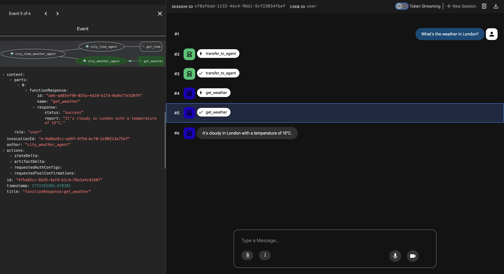

## Local setup
```bash
# Follow https://docs.ollama.com/quickstart
# Then pull the model
ollama pull llama3.2
ollama show llama3.2

brew install pyenv
brew install pyenv-virtualenv
pyenv install -s 3.13.12
pyenv global 3.13.12
pip install uv

echo -e '\n# Pyenv' >>  ~/.zshrc
echo -e '\neval "$(pyenv init -)"' >>  ~/.zshrc
echo -e '\neval "$(pyenv virtualenv-init -)"' >>  ~/.zshrc
```
## Build and create virtualenv
```bash
uv sync
```

## Provide API Google API keys to access gemini models
Login using your GA to https://aistudio.google.com/api-keys and create new key then paste to .env files for each agent
```
    GOOGLE_API_KEY=COPY_PASTE_YOUR_CODE HERE
```

## Run in the Google local ui 
```bash
source .venv/bin/activate
adk web --port 8080 # web interface 
```

## Run in the command line
```bash
source .venv/bin/activate
python main.py
```
